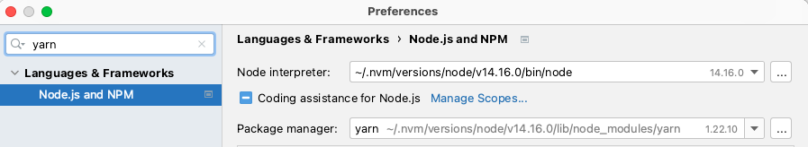
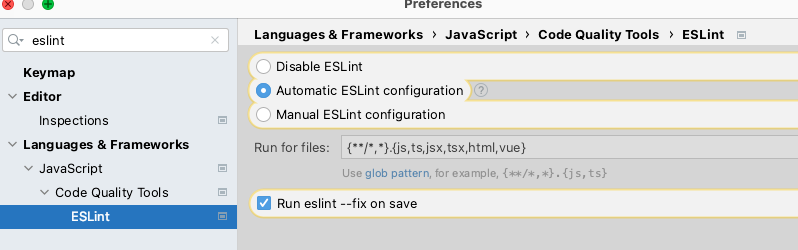

# chatroom-app-backend 🚀

## functional overview

## what is this project ?
The chatroom is real-time web chat application to be realized with modern web technologies.
- several chat rooms are available
- users can read the last 10 messages in the room when they enter it
- user can read new messages from other users
- user can write and send new messages
- user can see a list of available chat rooms
- user can join and leave a chat room
- user can see a list of users in a chatroom
- user can create a chat room by giving it a name

## how the project was designed ?
On the back side, I used socket io to manage the websocket. To have rooms already open, with messages and users, I set up a database and websevices to retrieve and display it.
To go further, I could have connected the users actions with MongoDB for data persistence.

# project setup
## technology stack use with Node.js
- Language : Typescript
- Database : MongoDB (no need to setup, it is online)
- HTTP Server : Express
- Websocket: socket.io
- Docker to deploy the app :
**https://chatroom-api-backend.onrender.com**

## table of content

- setup your laptop
- setup your IDE
- start the database and external tools
- build and run the project

## setup your laptop

you will need to setup those tools in order to work in the project :

### Node.js

Use [NVM](https://github.com/nvm-sh/nvm) to manage your node version.
Once you installed nvm, please check the `package.json` to know the correct minimum version of node to install :

```json
{
    "engines": {
        "node": ">=16.4 <17",  // this is the version you need to install
        "npm": ">=7 <8"
    }
}
```

## setup your IDE

### IntelliJ/Webstorm

- setup yarn as package manager for the project :
    - go to the global settings, then `Languages & Frameworks`
    - select you installation of Node.js if necessary
    - select `npm` as package manager



- setup eslint
    - go to the global settings, then `Languages & Frameworks` > `Javascript` > `Code Quality Tools` > `ESLint`
    - make sure to check `Automatic ESLint configuration` and `Run eslint --fix on save`



## build and run the project

### set up the environment

- Setup environment variables before running the api :
```bash
cp .env.tpl .env
```

### build and start

- Build the project (if necessary)
```bash
npm install
npm run build
```

- Start the api
```bash
npm run start:local
```


